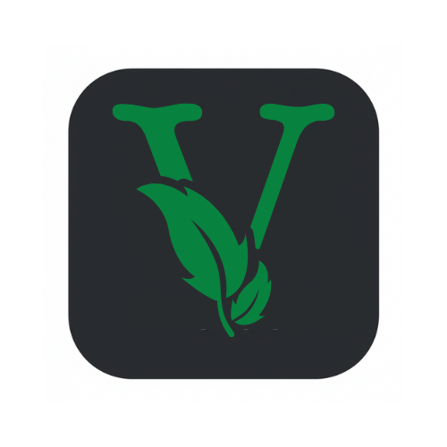

Verde 🌿

Connect. Swap. Save the Planet.

A hyper-local community marketplace and lost & found hub designed for TISB students.
 
<a href="#-features"><strong>Explore Features</strong></a> ·
<a href="#-getting-started"><strong>Get Started</strong></a> ·
<a href="https://www.google.com/search?q=https://github.com/BMWareSPEEDY/TISB-Swap/issues"><strong>Report Bug</strong></a>

📖 About The Project

Verde is more than just a marketplace; it's a bridge between sustainability and student life. Built for the United Hacks: Human Interaction Track, this app addresses the disconnect in school communities where valuable resources (textbooks, uniforms) are discarded while others struggle to find them.

By facilitating peer-to-peer swaps and digitizing the "Lost & Found" process, Verde turns cold transactions into meaningful human interactions. We don't just track items; we track the collective environmental impact of the entire campus.

Why is this useful?

Reduces Waste: Prevents usable school supplies from ending up in landfills.

Builds Community: Facilitates face-to-face interactions between seniors and juniors.

Promotes Honesty: A transparent Lost & Found hub encourages pro-social behavior.

Gamifies Impact: Real-time CO2 and Tree-saving metrics motivate students to participate.

✨ Features

♻️ Circular Marketplace: Buy (for free), donate, or swap essentials like textbooks, uniforms, and electronics.

🔍 Lost & Found Hub: Report missing items and claim found ones with a streamlined verification process.

💬 Secure Chat: Integrated messaging to coordinate safe, on-campus meetups (e.g., Library, Portico).

🌍 Live Impact Tracking: Visual dashboard showing the community's total CO2 saved and trees preserved.

🔒 Secure Access: Gated community ensures only verified students can participate.

📱 Native Experience: Adaptive icons and splash screens for a premium mobile feel.

🛠 Tech Stack

Verde is built with a focus on performance, scalability, and cross-platform compatibility.

Frontend: Flutter (Dart) - For a beautiful, native compiled application.

Backend: Supabase - An open-source Firebase alternative.

Auth: Secure email/password authentication.

Database: PostgreSQL with Row-Level Security (RLS).

Storage: Secure bucket for item and profile images.

🚀 Getting Started

Follow these steps to set up a local development environment.

Prerequisites

Flutter SDK: Install Flutter

Supabase Account: Create a project

Installation

Clone the repository

git clone [https://github.com/BMWareSPEEDY/TISB-Swap.git](https://github.com/BMWareSPEEDY/TISB-Swap.git)
cd TISB-Swap

Install dependencies

flutter pub get

Configure Environment
Create a .env file or update lib/utils/constants.dart with your Supabase credentials:

const supabaseUrl = 'YOUR_SUPABASE_URL';
const supabaseAnonKey = 'YOUR_SUPABASE_ANON_KEY';

Database Setup

Run the following SQL scripts in your Supabase SQL Editor to set up the necessary tables and security policies.

1. Create Tables & Functions

-- Enable RLS
ALTER TABLE items ENABLE ROW LEVEL SECURITY;

-- Create Impact Stats Function
CREATE OR REPLACE FUNCTION increment_user_stats(
  p_email TEXT, p_co2 FLOAT, p_points INT, p_items INT, p_trees FLOAT
) RETURNS VOID AS $$
BEGIN
  UPDATE profiles 
  SET co2_saved = co2_saved + p_co2,
      points = points + p_points,
      items_recycled = items_recycled + p_items,
      trees_saved = trees_saved + p_trees
  WHERE email = p_email;
END;
$$ LANGUAGE plpgsql;

2. Set RLS Policies (Development Mode)

-- Allow full access to authenticated users
CREATE POLICY "Full access items" ON public.items FOR ALL TO authenticated USING (true) WITH CHECK (true);
CREATE POLICY "Full access lost_found" ON public.lost_found FOR ALL TO authenticated USING (true) WITH CHECK (true);
CREATE POLICY "Full access profiles" ON public.profiles FOR ALL TO authenticated USING (true) WITH CHECK (true);

Running the App

# Generate launcher icons (optional)
dart run flutter_launcher_icons

# Run on emulator or device
flutter run

👤 Authors

BMWareSPEEDY - Solo Developer

Built with ❤️ for United Hacks. Save the planet, one swap at a time.

